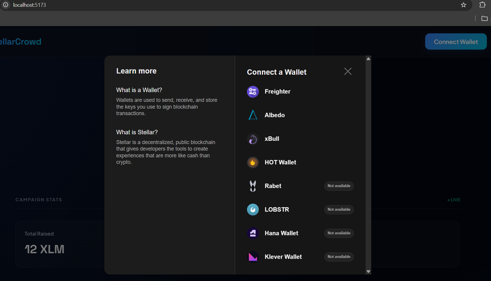

# StellarCrowd

A decentralized Stellar crowdfunding application built on the Stellar Testnet. This project fully implements the Level 2 criteria for the Stellar Developer Challenge, featuring multi-wallet integration, smart contract interaction (read and write), real-time event streaming, and comprehensive transaction status and error handling.

## Features (Level 2 Requirements Met)
- **Multi-Wallet Integration**: Built using `StellarWalletsKit` allowing connections from wallets like Freighter.
- **Smart Contract Integrated**: Deployed a crowdfunding contract to the Stellar Testnet.
- **Contract Calls (Frontend)**: Real-time read operations (`get_total_raised`, `get_donor_count`) and write operations (`donate`).
- **Real-time Event Handling**: Live Activity Feed utilizing event streaming for donation events.
- **Detailed Error Handling**: Properly catches and displays messages for missing wallets, user-rejected transactions, and insufficient balances.
- **Transaction Statuses**: Visually tracks transaction state changes (Preparing, Waiting for Approval, Submitting, Confirming) in the UI.

## Setup Instructions

1. **Clone the repository**
   ```bash
   git clone https://github.com/biswajit-sarkar-007/StellarCrowd.git
   cd StellarCrowd
   ```

2. **Install dependencies**
   ```bash
   npm install
   ```

3. **Run the development server**
   ```bash
   npm run dev
   ```
   Navigate to the localhost URL provided in your terminal.

## Submission Details

- **Deployed Contract Address**: `CA5IN4DYYCOTUYIXFEP7675RNN2CIFYSH4CAZHQ23KUKMGB65BJFYNVN`
- **Wallet Options Screenshot**: 
- **Transaction Hash of Contract Call**: `66abe4b9dc0792d4c041af4009af32b7962e230c9ad4d4801ab2de04251a2f03`

## Testing Error States
- **Wallet Unavailable**: Ensure no wallet extensions are unlocked/installed and attempt connection.
- **User Rejects**: Attempt a donation, but reject the signature request in your wallet.
- **Insufficient Balance**: Attempt to donate an amount larger than your Testnet XLM balance.
